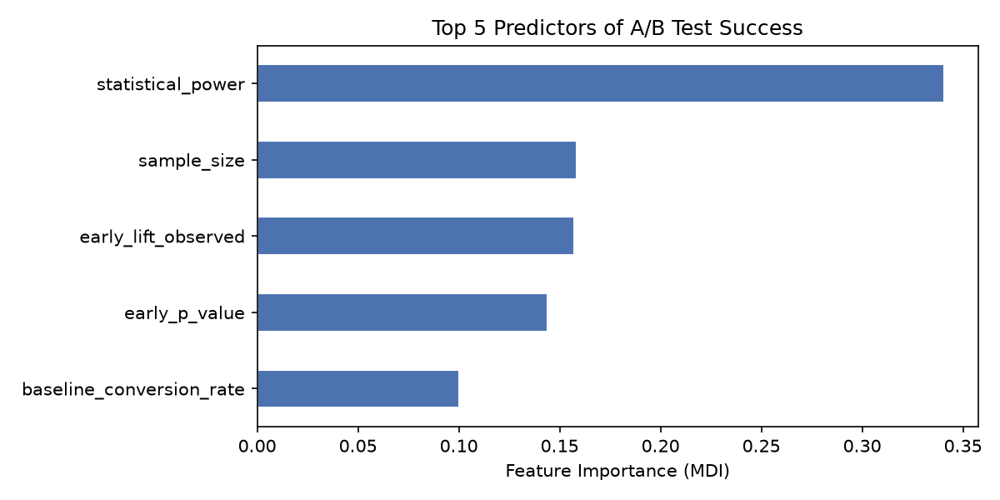
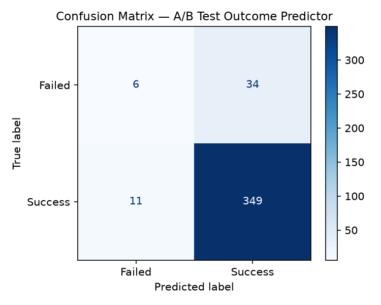

# 🧪 A/B Test Outcome Predictor (`ab_predictor`)

[](https://www.python.org/)
[](https://scikit-learn.org/)
<!--[](https://opensource.org/licenses/MIT)-->

An end-to-end Machine Learning and Statistical Modeling project that predicts the success probability of historical and ongoing A/B tests. 

By embedding first-principles statistical power calculations ($1 - \beta$) as engineered features into a Gradient Boosting pipeline, this model leverages both experimental setup context and early mid-test signals to predict final test outcomes.

---

## 📌 Project Overview

Running A/B tests to statistical significance can be time-consuming and expensive. Early termination of unpromising tests or optimization of statistical power prior to launching can save significant engineering and marketing resources.

This repository provides:
1. **Synthetic Data Generation Engine**: Simulates realistic A/B test setups adhering to statistical power laws and two-proportion z-test mathematics.
2. **First-Principles Statistical Power Module**: Computes statistical power ($1 - \beta$) from scratch given baseline conversion, expected lift, and sample sizes.
3. **ML Training & Evaluation Pipeline**: A robust `scikit-learn` Gradient Boosting Classifier pipeline complete with preprocessing, cross-validation, and feature importance analysis.

---

## 📊 Performance & Key Findings

* **Test Accuracy**: ~88.75%
* **Test ROC-AUC**: ~0.93+
* **5-Fold Cross-Validation (ROC-AUC)**: ~0.94 ± 0.01

### Feature Importance (Top Predictors)
Statistical power derived from hypothesis testing theory is by far the strongest signal for predicting A/B test success, proving that embedding statistical domain knowledge into ML pipelines outperforms relying on raw features alone.

| Feature Name | Type | Description |
| :--- | :--- | :--- |
| `statistical_power` | Engineered Numerical | Probability ($1 - \beta$) of detecting a true effect if present |
| `sample_size` | Numerical | Total sample size across control and treatment arms |
| `early_lift_observed` | Numerical | Observed lift at day 3 mid-test snapshot |
| `early_p_value` | Numerical | Calculated p-value at day 3 snapshot |
| `baseline_conversion_rate` | Numerical | Control group historical conversion rate |

<div align="center">
  
  <br/>
  <em>Figure 1: Feature Importances (MDI) from Gradient Boosting Model</em>
</div>

---

## 🛠️ Project Architecture & Data Flow
```text
┌────────────────────────────────┐
│  Phase 1: Synthetic Generator  │  ──> Generates 2,000 realistic A/B test records
└───────────────┬────────────────┘
│
▼
┌────────────────────────────────┐
│ Phase 3: Statistical Engine    │  ──> Calculates exact statistical power (1 - β)
└───────────────┬────────────────┘      via two-proportion z-test mathematics
│
▼
┌────────────────────────────────┐
│ Phase 2: Feature Engineering   │  ──> ColumnTransformer: One-Hot Encoding (cat)
│         & ML Pipeline          │      + StandardScaler (num) -> GradientBoosting
└───────────────┬────────────────┘
│
▼
┌────────────────────────────────┐
│ Phase 4: Model Evaluation      │  ──> Produces Confusion Matrix, ROC-AUC,
└────────────────────────────────┘      Feature Importance & Ablation Analysis
```
---

## 📈 Visualizations

### Confusion Matrix
<div align="center">
  
  <br/>
  <em>Figure 2: Confusion Matrix on Hold-out Test Set</em>
</div>

---

## 📂 Repository Structure

```text
ab_predictor/
├── ab_test_dataset.csv        # Synthetic dataset (2,000 rows × 10 features)
├── phase1_data_generation.py  # A/B test dataset generator script
├── phase2_model_pipeline.py   # Machine Learning pipeline & evaluation logic
├── phase3_statistical_power.py# Power & sample size analytical calculation engine
├── run_all.py                 # Master orchestrator script
├── requirements.txt           # Dependency requirements
├── confusion_matrix.png       # Evaluation plot artifact
└── feature_importance.png     # Top feature importance plot artifact
```

## 🚀 Getting Started
### 1. Prerequisites
Ensure you have Python 3.9+ installed.

### 2. Clone Repository & Install Dependencies
git clone [https://github.com/mayankprasad05/ab_predictor.git](https://github.com/mayankprasad05/ab_predictor.git)  
cd ab_predictor  
pip install -r requirements.txt

### 3. Run the Full Pipeline
To execute data generation, model training, evaluation, and statistical ablation studies in one go:

python run_all.py
